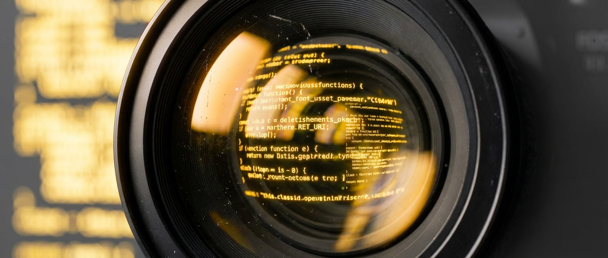
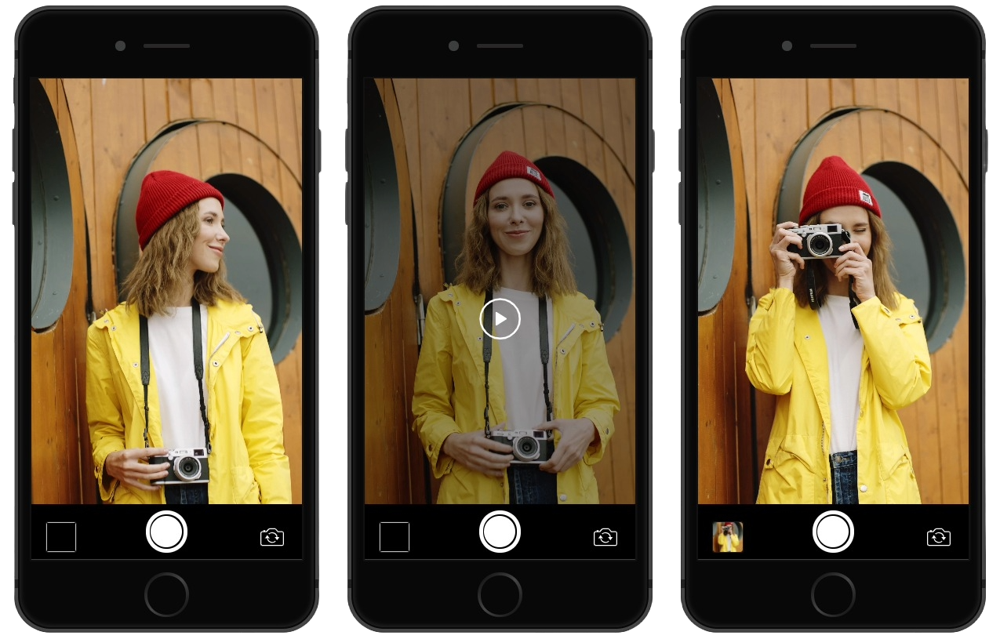

# js-camera



Zero-dependency camera element for the web.
Drop in `<js-camera>`, capture frames, and ship.

[Live Demo](https://shumatsumonobu.github.io/js-camera/)

- Web Components V1 — works with React, Vue, Svelte, or vanilla
- Capture as PNG / JPEG / WebP with resize, crop, and fit options
- Pinch-to-zoom on touch devices
- Built-in controls (play/pause, capture, face-switch) or go fully programmatic
- Front / back camera switching and device selection
- Zero dependencies, ~10 KB gzipped

```sh
npm install js-camera
```

## 3 Lines to Camera

```html
<meta name="viewport" content="width=device-width, initial-scale=1.0, maximum-scale=1.0, user-scalable=no">

<js-camera autoplay facing="back" controls></js-camera>
```

```js
import 'js-camera';
```

That's it. Play/pause, capture, face-switch — all built in. Fills the viewport by default.
The viewport meta prevents the browser from hijacking pinch-to-zoom.



### Custom Size

```css
js-camera {
  width: 400px;
  height: 300px;
}
```

## Go Deeper

Drop the `controls` attribute and take full control.

```js
import 'js-camera';

const camera = document.querySelector('js-camera');

// Open rear camera at Full HD
await camera.open({ facingMode: 'back', width: 1920, height: 1080 });

// Capture
const png = camera.capture();
const jpeg = camera.capture({ format: 'image/jpeg', width: 640, height: 480, fit: 'cover' });
const cropped = camera.capture({ extract: { x: 100, y: 50, width: 200, height: 200 } });

// Playback
camera.pause();
camera.play();

// Done
camera.close();
```

## Create on the Fly

```js
import Camera from 'js-camera';

const camera = Camera.createElement();
document.body.appendChild(camera);
await camera.open({ facingMode: 'front' });
```

## Listen

```js
camera
  .on('opened',   () => console.log('Ready'))
  .on('captured', (e) => upload(e.detail.capture))
  .on('paused',   () => console.log('Paused'))
  .on('played',   () => console.log('Resumed'));
```

| Event | Fires when | `event.detail` |
|-------|-----------|----------------|
| `opened` | Stream is ready | — |
| `captured` | Frame captured via built-in button | `.capture` — data URL |
| `paused` | Playback paused | — |
| `played` | Playback resumed | — |

## API

### HTML Attributes

| Attribute | Description | Default |
|-----------|-------------|---------|
| `autoplay` | Open camera on DOM insertion | — |
| `facing` | `"front"` or `"back"` (used with `autoplay`) | `"back"` |
| `width` | Desired resolution width (px) | device default |
| `height` | Desired resolution height (px) | device default |
| `controls` | Show built-in UI | — |

### Static Methods

| Method | Returns | Description |
|--------|---------|-------------|
| `Camera.define()` | `typeof Camera` | Register `<js-camera>`. Auto-called on import. |
| `Camera.createElement()` | `Camera` | Create a new element. Calls `define()` if needed. |

### Properties (read-only)

| Property | Type | Description |
|----------|------|-------------|
| `state` | `'open' \| 'loading' \| 'close'` | Lifecycle state |
| `opened` | `boolean` | Stream is active |
| `paused` | `boolean` | Playback is paused |
| `facingMode` | `'front' \| 'back' \| undefined` | Current direction |
| `deviceId` | `string \| undefined` | Active camera device ID |
| `resolution` | `{ width, height }` | Actual hardware resolution |
| `track` | `MediaStreamTrack \| undefined` | Active video track |
| `zoom` | `number` | Current zoom level (`1` = no zoom) |

### Methods

#### `open(options?): Promise<MediaTrackSettings>`

Opens the camera. Re-opens if already active.
Throws `DOMException` on denial or unavailable device.

| Option | Type | Default | Note |
|--------|------|---------|------|
| `facingMode` | `'front' \| 'back'` | `'front'` | Ignored when `deviceId` is set |
| `width` | `number` | — | Falls back to HTML attribute |
| `height` | `number` | — | Falls back to HTML attribute |
| `deviceId` | `string` | — | Target a specific camera |

#### `waitOpen(): Promise<void>`

Resolves when the camera finishes opening. Instant if not loading.

#### `close()`

Stops the stream and releases all resources.

#### `play(): Promise<void>`

Resumes from pause.

#### `pause()`

Freezes the current frame.

#### `resetZoom()`

Resets zoom level to 1. Pinch-to-zoom is built in — use two fingers on touch devices.

#### `capture(options?): string`

Returns a data URL of the current frame.

| Option | Type | Default | Note |
|--------|------|---------|------|
| `width` | `number` | — | Omit one to keep aspect ratio |
| `height` | `number` | — | Omit one to keep aspect ratio |
| `fit` | `'cover' \| 'contain' \| 'fill'` | `'fill'` | Same as CSS `object-fit` |
| `format` | `string` | `'image/png'` | `'image/jpeg'`, `'image/webp'`, etc. |
| `extract` | `{ x, y, width, height }` | — | Crop region in CSS pixels |

#### `queryPermission(): Promise<PermissionState | undefined>`

Returns `'granted'`, `'denied'`, `'prompt'`, or `undefined` if unsupported.

#### `revokePermission(): Promise<void>`

Revokes camera permission. Not supported in all browsers.

#### `getDevices(): Promise<Array<{ deviceId, label }>>`

Lists available cameras. Requests temporary access if needed.

#### `on(type, listener, options?): Camera`

Adds a listener. Returns `this` for chaining. Pass `{ once: true }` to auto-remove.

#### `off(type, listener): Camera`

Removes a listener. Returns `this` for chaining.

### Types

```ts
import Camera, { type CameraOpenOptions, type CaptureOptions } from 'js-camera';
```

```ts
interface CameraOpenOptions {
  facingMode?: 'front' | 'back';  // default: 'front'
  width?: number;
  height?: number;
  deviceId?: string;
}

interface CaptureOptions {
  width?: number;
  height?: number;
  extract?: { x: number; y: number; width: number; height: number };
  fit?: 'cover' | 'contain' | 'fill';  // default: 'fill'
  format?: string;                       // default: 'image/png'
}
```

## Browser Support

[Custom Elements V1](https://caniuse.com/custom-elementsv1) + [getUserMedia](https://caniuse.com/stream)

## Changelog

[CHANGELOG.md](CHANGELOG.md)

## Author

**shumatsumonobu** — [GitHub](https://github.com/shumatsumonobu) / [X](https://x.com/shumatsumonobu) / [Facebook](https://www.facebook.com/takuya.motoshima.7)

## License

[MIT](LICENSE)
